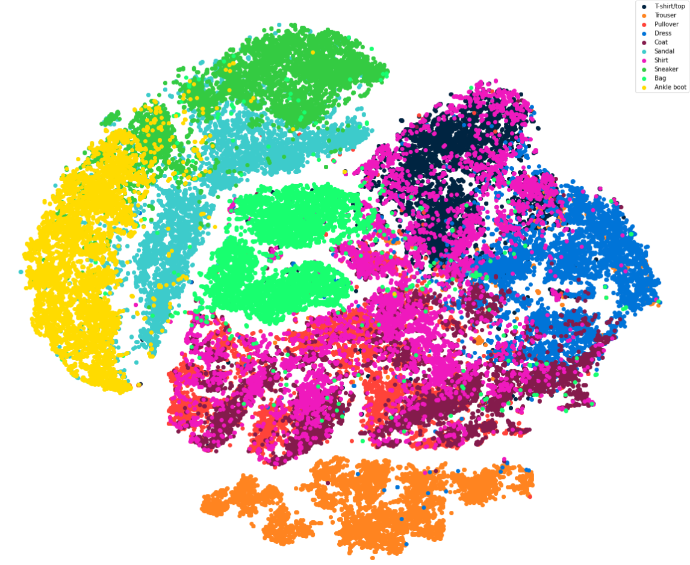

# fashion-mnist-classification

[](https://nbviewer.jupyter.org/github/ilias-ant/fashion-mnist-classification/tree/main) [](https://github.com/psf/black) 

Using MLPs and CNNs to classify Fashion-MNIST items.




## Installation

To enable reproducibility, [Poetry](https://python-poetry.org/) has been used as a dependency manager.

```shell
python3 -m pip install poetry
```

and then:

```shell
python3 -m poetry install
```

To serve the Jupyter notebooks, run:

```shell
python3 -m poetry run jupyter notebook
```

## Citation

For the Fashion-MNIST dataset:
```bibtex
@online{xiao2017/online,
  author       = {Han Xiao and Kashif Rasul and Roland Vollgraf},
  title        = {Fashion-MNIST: a Novel Image Dataset for Benchmarking Machine Learning Algorithms},
  date         = {2017-08-28},
  year         = {2017},
  eprintclass  = {cs.LG},
  eprinttype   = {arXiv},
  eprint       = {cs.LG/1708.07747},
}
```

For KerasTuner:
```bibtex
@misc{omalley2019kerastuner,
    title        = {KerasTuner},
    author       = {O'Malley, Tom and Bursztein, Elie and Long, James and Chollet, Fran\c{c}ois and Jin, Haifeng and Invernizzi, Luca and others},
    year         = 2019,
    howpublished = {\url{https://github.com/keras-team/keras-tuner}}
}
```